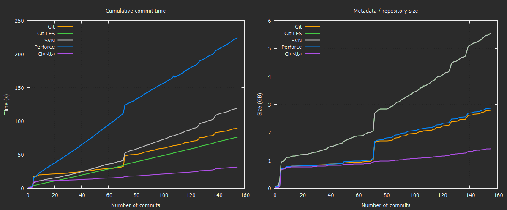

# Clustta VCS Benchmark

A replay-based benchmark comparing version-control systems on real-world creative project data. Measures **commit speed** and **storage efficiency** across Git, Git LFS, SVN, Perforce, and Clustta.

## Background

### What is Clustta?

[Clustta](https://clustta.com) is an open source version-control and collaboration platform purpose-built for creative work - think **GitHub meets Google Drive**, designed from the ground up for the kinds of large binary files (`.blend`, `.psd`, `.fbx`, `.mov`, etc.) that traditional VCS tools struggle with.

Whilst Git was built for text-based source code and SVN predates the modern cloud era, Clustta is a modern alternative that treats large, opaque binary assets as first-class citizens.

### Motivation

In 2023, Blender Studio published a benchmark comparing SVN, Git, Git LFS, and Mercurial for managing their film projects.

> **[Benchmarking Version Control Solutions for Creative Collaboration](https://studio.blender.org/blog/benchmarking-version-control-git-lfs-svn-mercurial/)**

Their conclusion: **Git LFS with pre-compressed `.blend` files** was the best available option - but still far from ideal for creative teams. That's exactly the trade-off Blender Studio found: LFS trades storage efficiency for commit speed.

This benchmark extends that approach by adding Clustta and Perforce to the comparison, using the same "replay every commit and measure" methodology on a real creative production project.

## Results

155 commits from a real Clustta creative project (~4.5 GB of `.blend` files) replayed into each system. Lower is better on both axes.



| System | Cumulative commit time | Repository size |
|--------|----------------------:|----------------:|
| **Clustta** | 30.0 s | 1,408 MB |
| **Git LFS** | 79.5 s | 5,549 MB |
| **Git** | 88.6 s | 2,788 MB |
| **SVN** | 125.5 s | 5,549 MB |
| **Perforce** | 224.4 s | 2,863 MB |

### Test environment

| Component | Detail |
|-----------|--------|
| CPU | Intel Core i7-14700F (20 cores / 28 threads, up to 5.4 GHz) |
| RAM | 16 GB DDR5 |
| Disk | Samsung PM9A1 1 TB NVMe SSD (~6,900 / 5,100 MB/s seq R/W) |
| OS | Windows 11 Pro (build 26200) |
| Git | 2.45.2 |
| SVN | 1.14.5 |
| Perforce | P4 2025.2/2907753 |
| Clustta | v0.4.33 |

## How it works

### Replay methodology

The benchmark follows the same basic approach Blender Studio used:

1. **Open** the source `.clst` project and build a chronological timeline of commit groups
2. **Stream** one commit at a time: reconstruct files from chunks, replay into all systems, then delete the staged files before moving to the next commit
3. **Measure** per-commit: commit/add time (seconds) and cumulative metadata/repository size (MB)
4. **Output** CSV data files and gnuplot visualisation scripts

Streaming extraction keeps disk usage low -- only one commit's files exist on disk at a time, making it possible to benchmark projects far larger than available free space.

### What each replayer does

| System | Commit operation timed | Metadata measured |
|--------|----------------------|-------------------|
| **Git** | `git add .` (staging into packfiles) | `.git/` directory |
| **Git LFS** | `git add .` + `git commit` + `git push` to bare upstream | `.git/` + upstream bare repo |
| **SVN** | `svn commit` to local `svnadmin` repository | `.svn/` + upstream repo |
| **Perforce** | `p4 reconcile` + `p4 submit` to local `p4d` | Server root (`db.*` + depot) |
| **Clustta** | Process and store via Clustta pipeline | `.clst` database file |

## Prerequisites

- **Go 1.22+**
- **Git** with **Git LFS** (`git lfs install`)
- **SVN** (`svn`, `svnadmin`)
- **Perforce** (`p4`, `p4d`) - optional, only needed if benchmarking Perforce
- **gnuplot** (for chart generation - optional)
- A Clustta `.clst` project file as the data source

## Usage

```bash
# Full run: stream and replay all 5 systems
go run ./cmd/benchmark \
  --source "/path/to/project.clst" \
  --output ./results \
  --systems git,git-lfs,svn,perforce,clustta

# Benchmark only the first 100 commits (useful for large projects)
go run ./cmd/benchmark \
  --source "/path/to/project.clst" \
  --output ./results \
  --limit 100

# Re-run specific systems using pre-staged files (batch mode)
go run ./cmd/benchmark \
  --source "/path/to/project.clst" \
  --output ./results \
  --systems svn,clustta \
  --skip-extract

# Regenerate charts from existing CSV data
go run ./cmd/benchmark --output ./results --report-only

# Generate PNG charts with gnuplot
cd results
gnuplot plot_benchmark.gnuplot
# Opens: benchmark_per_system.png  (2x2 per-system detail)
#        benchmark_summary.png     (side-by-side comparison overlay)
```

### Flags

| Flag | Default | Description |
|------|---------|-------------|
| `--source` | *(required)* | Path to source `.clst` file |
| `--output` | `./results` | Output directory for repos, CSVs, and charts |
| `--systems` | `git,git-lfs,svn,perforce,clustta` | Comma-separated list of systems to benchmark |
| `--limit` | `0` (all) | Max number of commit groups to process |
| `--skip-extract` | `false` | Use pre-staged files instead of streaming from `.clst` |
| `--report-only` | `false` | Regenerate gnuplot script from existing CSV data |

## References

- [Blender Studio: SVN vs Git LFS benchmark](https://studio.blender.org/blog/svn-vs-git-lfs/) - The original inspiration and methodology reference
- [Clustta](https://clustta.com) - Version control for creative work
